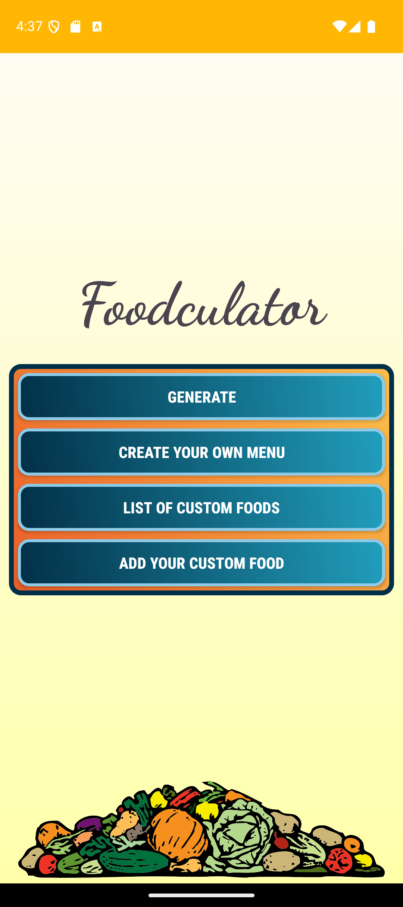
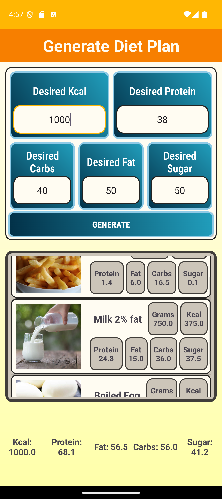
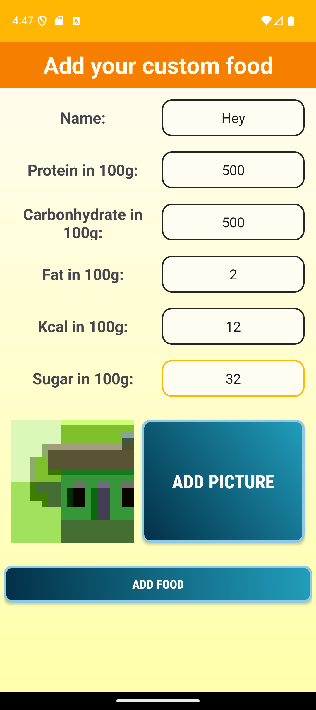
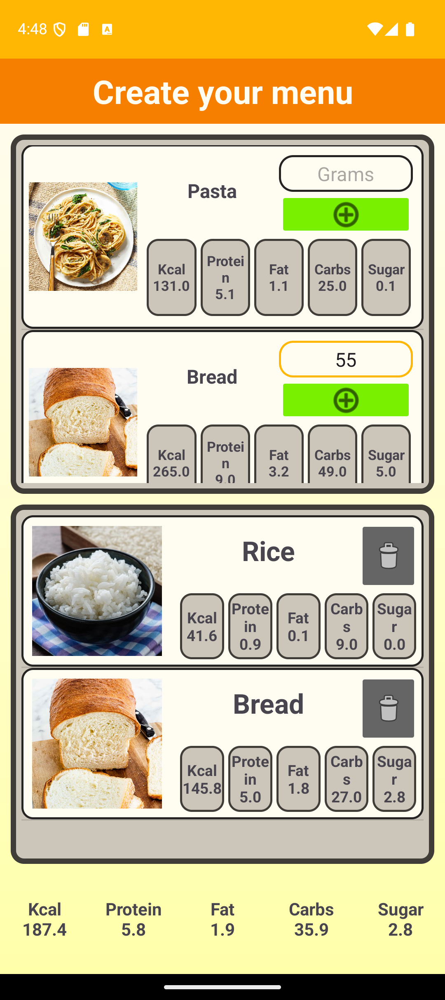

# Foodculator

Foodculator is an Android application developed as a final project for the **UYG201 - Introduction to Android Application Development** course at Istanbul Aydin University during the 2023-2024 fall semester.

Foodculator calculates the nutritional values (such as protein, carbs, and calories) of diet plans, generates personalized diet plans based on the nutritional values entered by the user, and allows users to create custom food entries if their specific foods are not found in the database.

## Used Technologies

The application is built using Java and XML, leveraging Android Studio for development.

## Disclaimer

This project is for educational purposes only and is not intended for personal use. The nutritional values and diet plans generated by the application should not be considered as professional dietary advice. Always consult with a healthcare professional or a registered dietitian before making significant changes to your diet or exercise routine.

The app uses vector math and Euclidean distance to generate diet plans, and even then, it can be quite inaccurate lol.

## Screenshot

   
